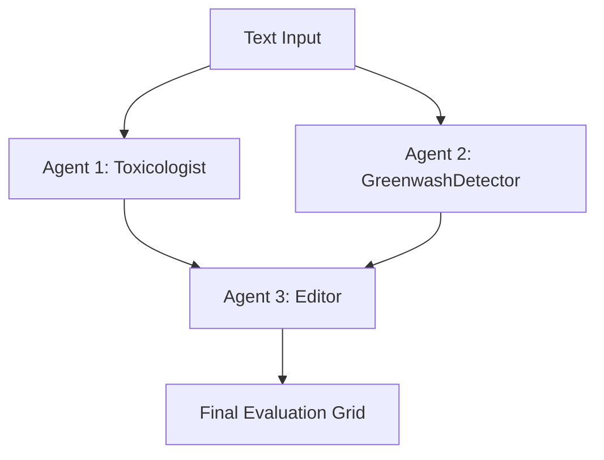

# EcoBuy: The Greenwashing Chemical & Product Safety Detective

**Track**: Agents for Good

## Problem Statement
Consumers are increasingly vulnerable to corporate greenwashing—where products are marketed as "clean," "natural," or "100% organic" while actually containing harmful chemicals and toxins. EcoBuy solves this by providing an automated, agentic safety evaluation to detect contradictions between marketing claims and actual chemical realities.

## Architecture



## Installation & Usage

1. **Install dependencies (using uv):**
   ```bash
   uv sync
   ```

2. **Run the local evaluation test dataset:**
   ```bash
   agents-cli eval grade
   ```

3. **Run the CLI application:**
   ```bash
   agents-cli run
   ```
